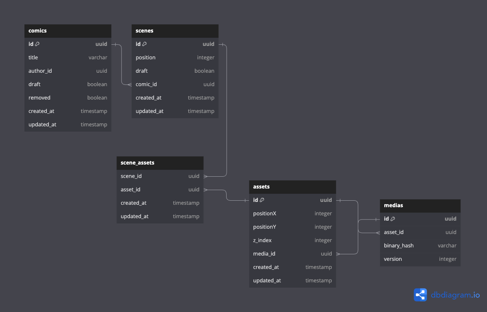

# kart-assessment

## POC

### Installation

First, ensure Docker is installed along with docker-compose.
Then, execute the following commands:

```shell
docker-compose build
```

```shell
docker-compose run
```

### Presentation

It took me a full day to complete this. Given the limited time, I had to be direct and efficient. There are no unit tests, error handlers, or a sophisticated code structure. Essentially, it's a one-day Proof of Concept (POC) ;)

This assessment consists of three components:

#### The Orchestrator

It's responsible for exposing two endpoints for:

Uploading user videos
Fetching TYCC ML job statuses
Moreover, it manages the rendering of the upload form and job status HTML page.
The orchestrator receives HTTP requests and enqueues job orders.
This service might typically be hosted as a serverless function.

#### The Workers

They are responsible for enqueuing job orders and initiating the model training pipeline.
They should be hosted on a high-resource machine with GPU capabilities.

#### The Monitor

It's responsible for listening to job events and persisting them into a database.
For instance, it could be hosted inside a VM, as an ECS Docker container, or in a K8S cluster.

#### Redis, localStack and MongoDb

I chose the BullMQ library for handling jobs, queues, and workers, which relies on Redis.
I used localStack to simulate AWS S3 locally.
I selected MongoDB for storing Job statuses in a basic document format.

## Architecture

### Database schema



### Architecture plan

[Miro board](https://miro.com/welcomeonboard/U0VXZnJmTTRJMXZvUklua2cxdmx6VFIwODhWRXpqdlpqWmZ4ZlhHaDNNcXBSc1BOME90TENPZGtzYWxJdjllYnwzMDc0NDU3MzU5OTM3NTM1NjMwfDI=?share_link_id=825274763729)

#### Analyse

For the architectural choice, I leaned towards serverless as much as possible to reduce infrastructure management needs, save idle time, and for the resilience of this kind of architecture.

For the Machine Learning pipelines part, I am not satisfied with the choice I made; I didn’t delve into it due to a lack of time.
I would go for EC2 machines with a lot of resources, but ideally, they should only be started when necessary without wasting precious time waiting for them to start. It would be necessary to explore what AWS offers.

To trigger ML jobs, I would use AWS SQS to ensure the proper delivery of commands while guaranteeing the order.

For the comics database, I am hesitating. I initially went with PostgreSQL because there are quite a few relationships between the assets, scenes, and comics. We could imagine that users create their own asset library or even scenes that they then include in their different comics.
Given more time to think, I believe my choice would lean towards a SQL/NoSQL mix. I would use NoSQL to persist the status of ML jobs as in the POC and maybe also the media collection.

On the mobile apps side, I went with a basic polling system when the user is connected and initiates an image processing order. I complemented it with a notification system when they leave the application.

I did not detail the feed part nor the comic "qualification" process according to the user because I exceeded the working day and would need to think about it longer.

I would be happy to have the opportunity to talk to you about all of this in more detail live.
